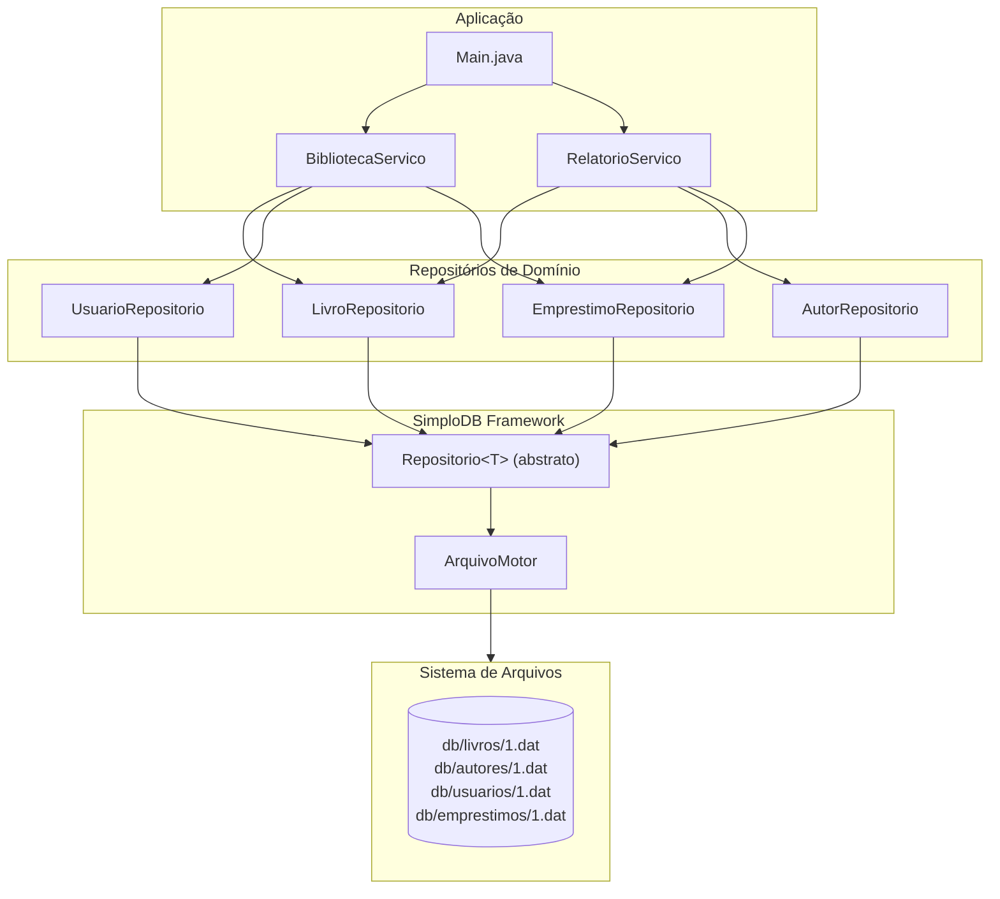
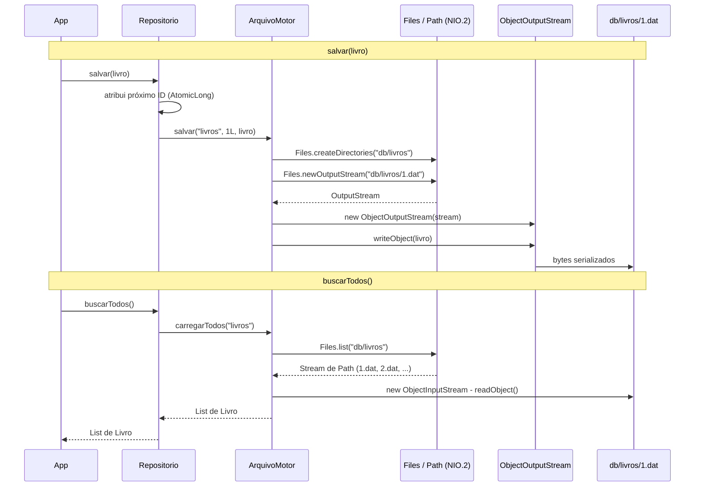
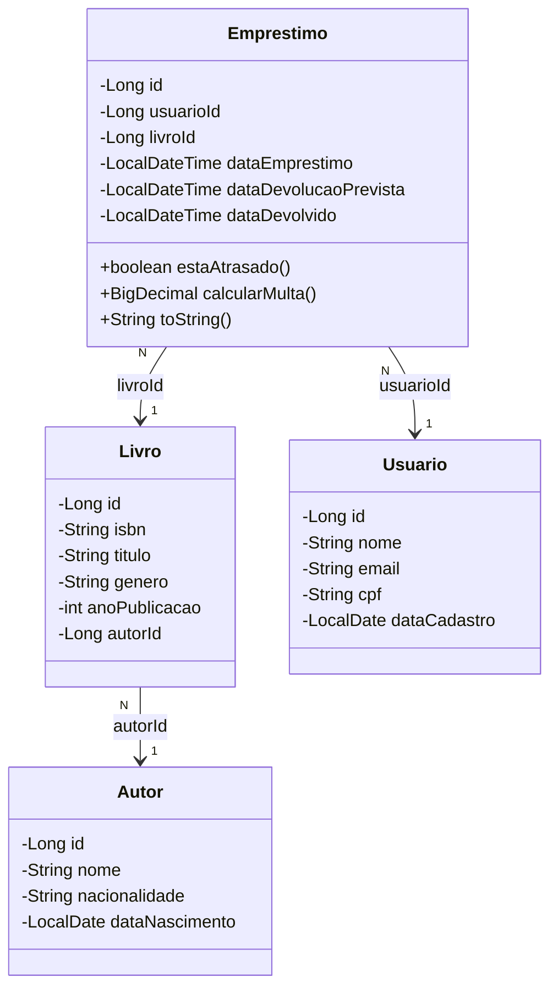
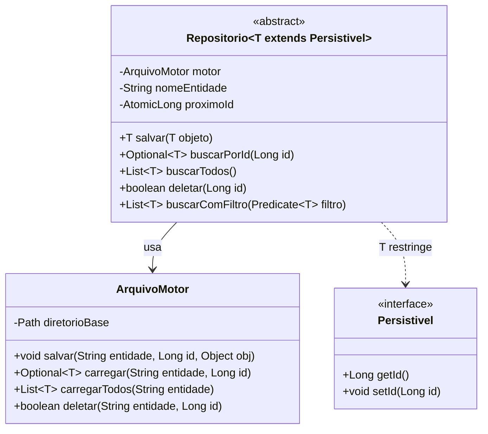

# Projeto Final — Biblioteca Digital com SimploDB

**Disciplina:** Técnicas de Programação
**Grupos:** conforme [grupos.md](grupos.md)

---

## Objetivo

Vocês vão implementar um sistema de gerenciamento de uma **biblioteca digital** usando uma camada de persistência própria chamada **SimploDB** — um mini-framework inspirado no Spring Data JPA que salva objetos Java diretamente em arquivos.

O framework já está parcialmente implementado. Vocês recebem o código com lacunas marcadas como `// TODO Exercício N` e precisam preenchê-las usando os conceitos vistos nos módulos do curso.

Ao final, o `Main.java` deve executar sem erros e os dados devem ser salvos e recarregados da pasta `db/`.

---

## Como o SimploDB funciona



Cada entidade é serializada (via `ObjectOutputStream`) e gravada em um arquivo `.dat` separado dentro da pasta `db/`. Na próxima execução, o `ArquivoMotor` lê esses arquivos de volta com `ObjectInputStream`.

---

## Fluxo de Persistência



---

## Entidades do Domínio



---

## Classes do Framework



---

## Estrutura do Projeto

```
src/
├── Main.java                               ✅ fornecido — ponto de entrada
│
├── simplodb/
│   ├── Persistivel.java                    ✅ fornecido — interface marker
│   ├── Repositorio.java                    ✏️  TODO #2 — buscarComFiltro()
│   └── ArquivoMotor.java                   ✏️  TODO #4 e #5 — persistência em arquivo
│
└── biblioteca/
    ├── modelo/
    │   ├── Autor.java                      ✅ fornecido
    │   ├── Livro.java                      ✅ fornecido
    │   ├── Usuario.java                    ✅ fornecido
    │   └── Emprestimo.java                 ✏️  TODO #1 — datas e multa
    │
    ├── repositorio/
    │   ├── AutorRepositorio.java           ✅ fornecido — exemplo completo
    │   ├── LivroRepositorio.java           ✏️  TODO #3a e #3b — streams
    │   ├── UsuarioRepositorio.java         ✅ fornecido
    │   └── EmprestimoRepositorio.java      ✅ fornecido
    │
    └── servico/
        ├── BibliotecaServico.java          ✏️  TODO #6 — Optional
        └── RelatorioServico.java           ✏️  TODO #3c, #3d e #7 (bônus)
```

---

## Regras de Negócio

| Regra | Detalhe |
|-------|---------|
| Prazo de empréstimo | 14 dias a partir da data/hora do empréstimo |
| Limite por usuário | Máximo de 3 empréstimos ativos simultâneos |
| Multa por atraso | R$ 1,00 por **dia inteiro** de atraso |
| Cálculo da multa (devolvido) | Calculada até a data de devolução efetiva |
| Cálculo da multa (em aberto) | Calculada até `LocalDateTime.now()` |
| ISBN único | Não pode haver dois livros com o mesmo ISBN |
| Livro único | Um livro só pode ter um empréstimo ativo por vez |

---

## Exercícios

### Exercício 1 — Datas (Módulo 1)
**Arquivo:** `src/biblioteca/modelo/Emprestimo.java`

Implemente os três métodos marcados com `// TODO Exercício 1`:

**1a) `estaAtrasado()`**
Retorna `true` se o empréstimo não foi devolvido e o prazo já passou.
Use `LocalDateTime.now()` e o método `isAfter()`.

**1b) `calcularMulta()`**
Calcula a multa em R$ (R$ 1,00/dia). Use `ChronoUnit.DAYS.between()` para contar os dias inteiros de atraso. Se devolvido, use a data de devolução como referência; se ainda em aberto, use `LocalDateTime.now()`.

**1c) `toString()`**
Formata um resumo legível do empréstimo. Crie um `DateTimeFormatter` com o padrão `"dd/MM/yyyy HH:mm"` e monte a String conforme os formatos abaixo:

```
// Em aberto, no prazo:
Empréstimo #1 | Livro: 2 | Usuário: 1 | Vence: 20/05/2026 14:30

// Atrasado:
Empréstimo #1 | Livro: 2 | Usuário: 1 | Vence: 06/04/2026 10:00 | ATRASADO | Multa: R$ 30,00

// Devolvido:
Empréstimo #1 | Livro: 2 | Usuário: 1 | Vence: 20/05/2026 14:30 | Devolvido: 15/05/2026 09:15
```

---

### Exercício 2 — Programação Funcional (Módulo 2)
**Arquivo:** `src/simplodb/Repositorio.java`

Implemente `buscarComFiltro(Predicate<T> filtro)`.

Este método é o **coração do SimploDB**: todos os repositórios dependem dele para fazer buscas customizadas. Chame `buscarTodos()` e aplique `stream().filter(filtro).collect(Collectors.toList())`.

Exemplo de uso após implementado:
```java
// Buscar livros de Romance:
List<Livro> romances = livroRepo.buscarComFiltro(l -> l.getGenero().equals("Romance"));

// Buscar usuários cujo nome começa com "A":
List<Usuario> usuarios = usuarioRepo.buscarComFiltro(u -> u.getNome().startsWith("A"));
```

---

### Exercício 3 — Streams (Módulo 3)
Quatro métodos para implementar usando a Stream API:

**3a)** `LivroRepositorio.buscarPorGeneroCoordenado(String genero)`
Liste os livros de um gênero (case-insensitive) do mais recente para o mais antigo.
Use `filter` + `sorted(Comparator.comparingInt(...).reversed())` + `collect`.

**3b)** `LivroRepositorio.agruparPorGenero()`
Agrupe todos os livros por gênero em um `Map<String, List<Livro>>`.
Use `Collectors.groupingBy(Livro::getGenero)`.

**3c)** `RelatorioServico.top5LivrosMaisEmprestados()`
Conte os empréstimos por livro (`groupingBy` + `counting`), ordene do mais emprestado para o menos e retorne até 5 livros.

**3c)** `BibliotecaServico.agruparEmprestimosPorUsuario()`
Agrupe todos os empréstimos por usuário em um `Map<Usuario, List<Emprestimo>>`.
Use `Collectors.groupingBy()` para organizar os empréstimos conforme o usuário responsável.

**3d)** `BibliotecaServico.filtrarEmprestimosAtrasados()`
Filtre e retorne apenas os empréstimos que estão atrasados (não devolvidos e já passaram do prazo).
Use `stream().filter(Emprestimo::estaAtrasado).collect(Collectors.toList())`.

---

### ✅ Soluções Implementadas: 3c e 3d

As questões 3c e 3d foram implementadas e documentadas com exemplos práticos.

**Arquivo:** `src/biblioteca/servico/BibliotecaServico.java`  
**Documentação:** [SOLUCOES_3C_3D.md](SOLUCOES_3C_3D.md)

#### 3c — Agrupar Empréstimos por Usuário

```java
public Map<Usuario, List<Emprestimo>> agruparEmprestimosPorUsuario(List<Emprestimo> emprestimos) {
    return emprestimos.stream()
            .collect(Collectors.groupingBy(emprestimo -> 
                usuarioRepo.buscarPorId(emprestimo.getUsuarioId())
                        .orElseThrow(...)
            ));
}
```

**Conceito:** Utiliza `Collectors.groupingBy()` para organizar os empréstimos conforme o usuário.  
**Retorno:** `Map<Usuario, List<Emprestimo>>` com usuários como chaves e suas listas de empréstimos.

#### 3d — Filtrar Empréstimos Atrasados

```java
public List<Emprestimo> filtrarEmprestimosAtrasados(List<Emprestimo> emprestimos) {
    return emprestimos.stream()
            .filter(Emprestimo::estaAtrasado)
            .collect(Collectors.toList());
}
```

**Conceito:** Utiliza `filter()` para retornar apenas os empréstimos que estão atrasados.  
**Retorno:** `List<Emprestimo>` contendo apenas empréstimos não devolvidos que já passaram do prazo.

> Para entender melhor o passo a passo de cada solução, exemplos de uso e comparação com abordagens tradicionais, veja [SOLUCOES_3C_3D.md](SOLUCOES_3C_3D.md).

---

### Exercício 3e — Relatório (complementar a 3d)

**3e)** `RelatorioServico.multasPendentesPorUsuario()`
Filtre os empréstimos atrasados e some as multas por usuário usando `Collectors.toMap` com a função de merge `BigDecimal::add`.

---

### Exercício 4 — NIO.2 (Módulo 4)
**Arquivo:** `src/simplodb/ArquivoMotor.java` — método `carregarTodos()`

Use `Files.list(dir)` para obter um `Stream<Path>` com todos os arquivos `.dat` do diretório da entidade. Para cada `Path`, extraia o ID do nome do arquivo e chame `carregar()`. Lembre-se de fechar o stream com `try-with-resources`.

---

### Exercício 5 — IO Streams (Módulo 5)
**Arquivo:** `src/simplodb/ArquivoMotor.java`

**5a) `salvar()`** — Serialize o objeto com `ObjectOutputStream`:
```java
Files.createDirectories(dir);
try (ObjectOutputStream oos = new ObjectOutputStream(Files.newOutputStream(caminho))) {
    oos.writeObject(obj);
}
```

**5b) `carregar()`** — Desserialize com `ObjectInputStream`:
```java
if (Files.notExists(caminho)) return Optional.empty();
try (ObjectInputStream ois = new ObjectInputStream(Files.newInputStream(caminho))) {
    return Optional.of((T) ois.readObject());
}
```

**Atenção:** sempre use `try-with-resources` para garantir que os streams são fechados.

---

### Exercício 6 — Optional (Módulo 6)
**Arquivo:** `src/biblioteca/servico/BibliotecaServico.java` — método `registrarEmprestimo()`

Implemente a lógica de negócio usando `Optional` encadeado:
1. Use `orElseThrow()` para garantir que o usuário e o livro existem
2. Valide o limite de empréstimos com `validarLimiteEmprestimos()`
3. Use `findFirst().ifPresent()` para lançar exceção se o livro já estiver emprestado
4. Crie e salve o `Emprestimo`

Consulte o método `devolverLivro()` no mesmo arquivo como exemplo de `Optional` em uso.

---

### Exercício 7 ⭐ BÔNUS — Programação Paralela (Módulo 7)
**Arquivo:** `src/biblioteca/servico/RelatorioServico.java` — método `gerarRelatorioCompleto()`

As três consultas do relatório são independentes entre si. Execute-as em paralelo com `CompletableFuture.supplyAsync()` usando um `ExecutorService` de 3 threads. Combine os resultados com `CompletableFuture.allOf(...).join()` e retorne um `RelatorioCompleto`.

```java
ExecutorService executor = Executors.newFixedThreadPool(3);
CompletableFuture<List<Livro>> futureTop5 =
    CompletableFuture.supplyAsync(() -> top5LivrosMaisEmprestados(), executor);
// ... demais futures ...
CompletableFuture.allOf(futureTop5, futureMultas, futureGeneros).join();
executor.shutdown();
```

---

## Como Compilar e Executar

```bash
# Na raiz do projeto (onde está a pasta src/)

# Compilar
javac -d out \
  src/simplodb/*.java \
  src/biblioteca/modelo/*.java \
  src/biblioteca/repositorio/*.java \
  src/biblioteca/servico/*.java \
  src/Main.java

# Executar
java -cp out Main

# Limpar o banco de dados (apagar todos os dados salvos)
rm -rf db/
```

> **Dica:** A pasta `db/` é criada automaticamente na primeira execução. Execute duas vezes seguidas para verificar que os dados são recarregados corretamente na segunda vez.

---

## Saída Esperada

Ao implementar todos os TODOs (exceto o bônus), a execução de `Main.java` deve produzir uma saída similar a:

```
=== Cadastrando autores ===
Autor{id=1, nome='Machado de Assis', ...}
Autor{id=2, nome='Clarice Lispector', ...}
Autor{id=3, nome='Carlos Drummond de Andrade', ...}

=== Registrando empréstimos ===
Empréstimo #1 | Livro: 1 | Usuário: 1 | Vence: 20/05/2026 14:30
Empréstimo #2 | Livro: 2 | Usuário: 1 | Vence: 20/05/2026 14:30
Empréstimo #3 | Livro: 3 | Usuário: 2 | Vence: 20/05/2026 14:30

=== Tentando emprestar livro já emprestado ===
OK — exceção esperada: Livro já está emprestado: 1

=== Livros de Romance (ordenados por ano, mais recente primeiro) ===
Livro{id=2, titulo='A Hora da Estrela', ano=1977}
Livro{id=5, titulo='Perto do Coração Selvagem', ano=1943}
Livro{id=1, titulo='Dom Casmurro', ano=1899}
Livro{id=3, titulo='Memórias Póstumas de Brás Cubas', ano=1881}
```

---

## Critérios de Avaliação

### Código (70%)

| Módulo | Exercício | Peso |
|--------|-----------|------|
| 1. Datas | `estaAtrasado()`, `calcularMulta()`, `toString()` | 20% |
| 2. Prog. Funcional | `buscarComFiltro()` | 10% |
| 3. Streams | 4 métodos de consulta e agrupamento | 30% |
| 4. NIO.2 | `carregarTodos()` com `Files.list()` | 15% |
| 5. IO Streams | `salvar()` e `carregar()` com serialização | 15% |
| 6. Optional | `registrarEmprestimo()` com regras de negócio | 10% |
| **7. Paralelo ⭐** | **`gerarRelatorioCompleto()` com CompletableFuture** | **+10% bônus** |

**Critérios gerais:**
- O código deve compilar sem erros
- O `Main.java` deve executar até o fim sem exceções não tratadas
- A saída esperada deve aparecer corretamente
- Os dados devem persistir entre execuções (executar duas vezes não deve duplicar registros)

### Apresentação (30%)

Cada grupo deve preparar e apresentar os slides ao final do projeto. Ver seção **Entregável 2** abaixo.

---

## Ordem Sugerida de Implementação

Implemente nesta ordem para desbloquear as funcionalidades gradualmente:

```
5a e 5b  →  4  →  2  →  1  →  6  →  3  →  7 (bônus)
(salvar)   (listar) (filtro) (datas) (optional) (streams) (paralelo)
```

Sem os exercícios 5 e 4, nada é salvo/carregado. Sem o exercício 2, nenhum repositório funciona. Os demais dependem de tudo anterior estar funcionando.

---

## Entregável 2 — Apresentação

Além do código, cada grupo deve preparar uma apresentação de **10 a 15 minutos** cobrindo os tópicos abaixo.

### Estrutura dos slides

**1. Introdução (1–2 slides)**
- Nome do grupo e membros
- Visão geral do projeto: o que é a Biblioteca Digital e o que o SimploDB faz

**2. Arquitetura e decisões técnicas (2–3 slides)**
- Como o SimploDB funciona: o caminho de um objeto desde o `salvar()` até o arquivo `.dat`
- Por que serialização? Quais as vantagens e limitações em relação a um banco de dados real?
- Qual foi a parte mais interessante da arquitetura para o grupo?

**3. Conceitos aplicados (1 slide por módulo, escolha 3)**
Escolham 3 dos módulos abaixo e expliquem como o conceito aparece no código de vocês:
- **Datas:** como `ChronoUnit.DAYS.between()` calcula a multa corretamente
- **Programação Funcional:** o que é um `Predicate<T>` e por que `buscarComFiltro` é poderoso
- **Streams:** qual pipeline de stream foi mais difícil de montar e por quê
- **NIO.2:** diferença entre `Files.list()` e uma leitura tradicional com `File`
- **IO Streams:** o que acontece internamente quando `ObjectOutputStream.writeObject()` é chamado
- **Optional:** como `orElseThrow` e `ifPresent` substituem verificações de `null`

**4. Dificuldades e desafios (1–2 slides)**
- Qual exercício deu mais trabalho? Por quê?
- Algum erro difícil de depurar? Como resolveram?
- O que fariam diferente se recomeçassem?

**5. Aprendizados (1 slide)**
- O que o grupo considera o aprendizado mais importante do projeto
- Como os conceitos do curso se conectam no mundo real

**6. Demo ao vivo (opcional, mas recomendado)**
- Executar o `Main.java` ao vivo mostrando os dados sendo salvos e recarregados

### Critérios de avaliação da apresentação

| Critério | Peso |
|----------|------|
| Clareza na explicação dos conceitos técnicos | 40% |
| Profundidade na análise das dificuldades | 25% |
| Qualidade dos slides (objetividade, organização) | 20% |
| Participação de todos os membros do grupo | 15% |

### Formato

- **Ferramenta:** livre (Google Slides, PowerPoint, Keynote, Marp, etc.)
- **Duração:** 10 a 15 minutos + até 5 minutos de perguntas
- **Entrega dos slides:** commitar o arquivo (PDF ou link) no repositório do grupo antes da apresentação

---

## Observações Técnicas

- Java 17+ sem dependências externas
- `serialVersionUID` já definido em todas as entidades — não alterar
- A pasta `db/` não é versionada (está no `.gitignore`)
- Para testar o recarregamento: execute, encerre, execute novamente sem apagar `db/`
- Use `try-with-resources` em todos os streams de I/O para evitar vazamento de recursos
