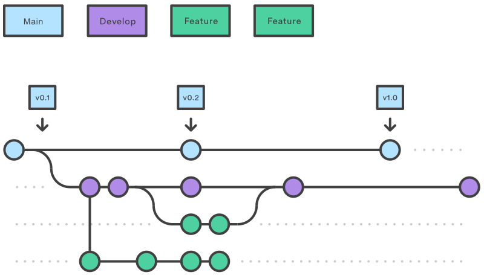
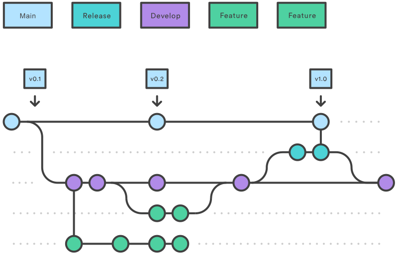
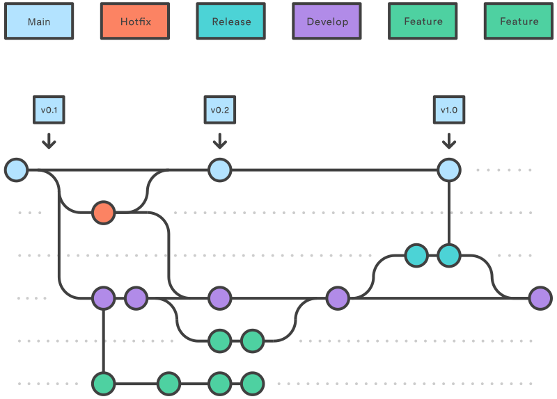

# Fluxo de trabalho Gitflow

Gitflow é um fluxo de trabalho legado do Git que originalmente foi uma estratégia inovadora e disruptiva para gerenciamento de branches no Git. O Gitflow perdeu popularidade em favor de workflows baseados em trunk, que atualmente são considerados boas práticas para desenvolvimento contínuo de software moderno e práticas de DevOps. O Gitflow também pode ser desafiador de utilizar com CI/CD. Este artigo detalha o Gitflow para fins históricos.

## O que é Gitflow?

Gitflow é um modelo alternativo de branching no Git que envolve o uso de feature branches e múltiplas branches principais. Ele foi publicado originalmente e popularizado por Vincent Driessen no nvie. Comparado ao desenvolvimento baseado em trunk, o Gitflow possui diversas branches de longa duração e commits maiores. Nesse modelo, os desenvolvedores criam uma feature branch e adiam o merge dela na branch trunk principal até que a funcionalidade esteja concluída. Essas feature branches de longa duração exigem mais colaboração para realizar merge e possuem maior risco de se desviarem da branch trunk. Elas também podem introduzir atualizações conflitantes.

O Gitflow pode ser utilizado em projetos que possuem um ciclo de releases agendado e para a prática DevOps de entrega contínua. Esse fluxo de trabalho não adiciona novos conceitos ou comandos além do que já é necessário para o Feature Branch Workflow. Em vez disso, ele atribui papéis muito específicos para diferentes branches e define como e quando elas devem interagir. Além das branches `feature`, ele utiliza branches individuais para preparação, manutenção e registro de releases. Naturalmente, você também aproveita todos os benefícios do Feature Branch Workflow: pull requests, experimentos isolados e colaboração mais eficiente.

## Como funciona


### Branches develop e main

Em vez de utilizar apenas uma branch `main`, esse fluxo de trabalho utiliza duas branches para registrar o histórico do projeto. A branch `main` armazena o histórico oficial de releases, enquanto a branch `develop` serve como branch de integração para funcionalidades. Também é conveniente marcar todos os commits da branch `main` com um número de versão.

O primeiro passo é complementar a branch padrão `main` com uma branch `develop`. Uma forma simples de fazer isso é um desenvolvedor criar uma branch `develop` vazia localmente e enviá-la para o servidor:

```bash
git branch develop
git push -u origin develop
```

Essa branch conterá o histórico completo do projeto, enquanto a `main` conterá uma versão mais resumida. Os outros desenvolvedores deverão clonar o repositório central e criar uma tracking branch para a `develop`.

Ao utilizar a biblioteca de extensões git-flow, executar `git flow init` em um repositório existente criará a branch `develop`:

```bash
$ git flow init
```
```
Initialized empty Git repository in ~/project/.git/
No branches exist yet. Base branches must be created now.
Branch name for production releases: [main]
Branch name for "next release" development: [develop]

How to name your supporting branch prefixes?
Feature branches? [feature/]
Release branches? [release/]
Hotfix branches? [hotfix/]
Support branches? [support/]
Version tag prefix? []
```
```bash
$ git branch
```
```
* develop
 main
```

## Feature branches

### Criando o repositório

Cada nova funcionalidade deve existir em sua própria branch, que pode ser enviada para o repositório central para backup e colaboração. Porém, em vez de serem criadas a partir da `main`, as branches `feature` utilizam a `develop` como branch pai. Quando uma funcionalidade estiver concluída, ela é integrada novamente na `develop`. Funcionalidades nunca devem interagir diretamente com a `main`.



Observe que as branches `feature`, combinadas com a branch `develop`, são essencialmente o Feature Branch Workflow. Porém, o fluxo de trabalho Gitflow não para por aí.

As branches `feature` geralmente são criadas a partir da versão mais recente da `develop`.

### Criando uma feature branch

Sem utilizar as extensões git-flow:

```bash
git checkout develop
git checkout -b feature_branch
```

Utilizando a extensão git-flow:

```bash
git flow feature start feature_branch
```

Continue seu trabalho e utilize o Git normalmente, como de costume.

### Finalizando uma feature branch

Quando o desenvolvimento da funcionalidade estiver concluído, o próximo passo é realizar o merge da `feature_branch` na `develop`.

Sem utilizar as extensões git-flow:

```bash
git checkout develop
git merge feature_branch
```

Utilizando a extensão git-flow:

```bash
git flow feature finish feature_branch
```

## Release branches



Quando a `develop` possuir funcionalidades suficientes para uma release (ou quando uma data de release previamente definida estiver se aproximando), você cria uma branch `release` a partir da `develop`. A criação dessa branch inicia o próximo ciclo de release, portanto nenhuma nova funcionalidade deve ser adicionada após esse ponto — apenas correções de bugs, geração de documentação e outras tarefas relacionadas à release devem ser realizadas nessa branch. Quando estiver pronta para publicação, a branch `release` é integrada à `main` e marcada com um número de versão. Além disso, ela também deve ser integrada novamente à `develop`, que pode ter evoluído desde o início da release.

Utilizar uma branch dedicada para preparar releases permite que uma equipe refine a release atual enquanto outra equipe continua trabalhando em funcionalidades para a próxima release. Isso também cria fases de desenvolvimento bem definidas (por exemplo, é fácil dizer: “Nesta semana estamos preparando a versão 4.0” e realmente visualizar isso na estrutura do repositório).

Criar branches `release` é outra operação de branching bastante simples. Assim como as branches `feature`, as branches `release` são baseadas na branch `develop`. Uma nova branch `release` pode ser criada utilizando os seguintes métodos.

Sem utilizar as extensões git-flow:

```bash
git checkout develop
git checkout -b release/0.1.0
```

Utilizando as extensões git-flow:

```bash
$ git flow release start 0.1.0
```
```
Switched to a new branch 'release/0.1.0'
```

Quando a release estiver pronta para publicação, ela será integrada tanto na `main` quanto na `develop`, e então a branch `release` será removida. É importante realizar o merge de volta na `develop`, pois atualizações críticas podem ter sido adicionadas na branch `release`, e elas precisam estar disponíveis para novas funcionalidades. Se a sua organização valoriza revisão de código, este seria um momento ideal para abrir um pull request.

Para finalizar uma branch `release`, utilize os seguintes métodos:

Sem utilizar as extensões git-flow:

```bash
git checkout main
git merge release/0.1.0
```

Ou utilizando a extensão git-flow:

```bash
git flow release finish '0.1.0'
```

## Hotfix branches



Branches de manutenção, ou `hotfix`, são utilizadas para corrigir rapidamente problemas em releases que já estão em produção. As branches `hotfix` são muito semelhantes às branches `release` e `feature`, com a diferença de que elas são baseadas na `main` em vez da `develop`. Essa é a única branch que deve ser criada diretamente a partir da `main`. Assim que a correção estiver concluída, ela deve ser integrada tanto na `main` quanto na `develop` (ou na branch `release` atual), e a `main` deve receber uma tag com o número de versão atualizado.

Possuir uma linha de desenvolvimento dedicada para correções de bugs permite que sua equipe resolva problemas sem interromper o restante do fluxo de trabalho ou esperar pelo próximo ciclo de release. Você pode pensar nas branches de manutenção como branches `release` criadas de forma ad hoc, trabalhando diretamente com a `main`. Uma branch `hotfix` pode ser criada utilizando os seguintes métodos:

Sem utilizar as extensões git-flow:

```bash
git checkout main
git checkout -b hotfix_branch
```

Utilizando as extensões git-flow:

```bash
$ git flow hotfix start hotfix_branch
```

Assim como ao finalizar uma branch `release`, uma branch `hotfix` é integrada tanto na `main` quanto na `develop`.

Sem utilizar as extensões git-flow:

```bash
git checkout main
git merge hotfix_branch
git checkout develop
git merge hotfix_branch
git branch -D hotfix_branch
```

Utilizando as extensões git-flow:

```bash
$ git flow hotfix finish hotfix_branch
```

## Exemplo

Um exemplo completo demonstrando o fluxo de Feature Branch é apresentado a seguir, assumindo que temos um repositório configurado com uma branch `main`.

```bash
git checkout main
git checkout -b develop
git checkout -b feature_branch
```
```
# trabalho sendo realizado na feature branch
```
```bash
git checkout develop
git merge feature_branch
git checkout main
git merge develop
git branch -d feature_branch
```

Além do fluxo de `feature` e `release`, um exemplo de `hotfix` é apresentado a seguir:

```bash
git checkout main
git checkout -b hotfix_branch
```
```
# o trabalho é realizado e commits são adicionados à hotfix_branch
```
```bash
git checkout develop
git merge hotfix_branch
git checkout main
git merge hotfix_branch
```

## Resumo

Aqui discutimos o fluxo de trabalho Gitflow. O Gitflow é um dos diversos estilos de workflows Git que você e sua equipe podem utilizar.

Alguns pontos importantes sobre o Gitflow são:

- O fluxo de trabalho é excelente para um modelo de desenvolvimento de software baseado em releases.

- O Gitflow oferece um canal dedicado para hotfixes em produção.

O fluxo geral do Gitflow é:

1. Uma branch `develop` é criada a partir da `main`

2. Uma branch `release` é criada a partir da `develop`

3. Branches `feature` são criadas a partir da `develop`

4. Quando uma `feature` estiver concluída, ela é integrada na branch `develop`

5. Quando a branch `release` estiver concluída, ela é integrada tanto na `develop` quanto na `main`

6. Se um problema for identificado na `main`, uma branch `hotfix` é criada a partir da `main`

7. Quando o `hotfix` estiver concluído, ele é integrado tanto na `develop` quanto na `main`

## Extra

### Instalação do git-flow

O `git-flow` é uma extensão do Git que automatiza o workflow Gitflow através de comandos prontos para criação e gerenciamento de branches como `feature`, `release` e `hotfix`.

#### Windows (Chocolatey)

```bash
choco install gitflow-avh
```

#### Windows (Scoop)

```bash
scoop install git-flow-avh
```

#### Ubuntu/Debian

```bash
sudo apt install git-flow
```

#### macOS

```bash
brew install git-flow-avh
```

### Como verificar se está instalado

```bash
git flow version
```

Ou:

git flow init -h
```bash
git flow init -h
```

---

Este documento é uma tradução livre do guia disponível em: [Atlassian: gitflow-workflow](https://www.atlassian.com/git/tutorials/comparing-workflows/gitflow-workflow)

---
